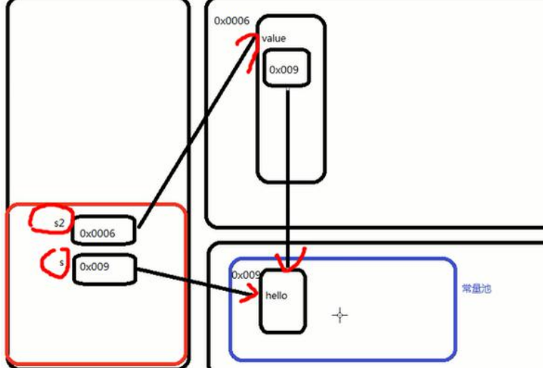

# Java

## 1.Java诞生的小故事

**Java官网：**[**https://www.java.com/zh-CN/**](https://www.java.com/zh-CN/)

<figure><figcaption></figcaption></figure>

## 2.Java 技术体系平台

<figure><figcaption></figcaption></figure>

## 3.Java重要特点

> 1. Java 语言是面向对象的(**OOP**)
> 2. Java 语言是**健壮的**。Java 的强类型机制、异常处理、垃圾的自动收集等是 Java 程序健壮性的重要保证
> 3.  Java 语言是跨平台性的。\[即: 一个编译好的.class 文件可以在多个系统下运行，这种特性称为跨平台]
>
>
>
>     <figure><figcaption></figcaption></figure>
> 4. Java 语言是解释型的\[了解]&#x20;
>    * 解释性语言：javascript,PHP, java&#x20;
>    * 编译性语言: c / c++&#x20;
>    * 区别是：解释性语言，编译后的代码，不能直接被机器执行,需要解释器来执行, 编译性语言, 编译后的代码, 可 以直接被机器执行, c /c++

## 4.下载安装JDK

* 官网地址：[https://www.oracle.com/java/technologies/downloads/](https://www.oracle.com/java/technologies/downloads/)
*   细节说明

    > * 安装路径不要有中文或者特殊符号如空格等。
    > * 比如d:\program\jdk8
    > * 当提示安装JRE时，可以选择不安装，也可以安装

*   Java配置环境变量path

    > 1. 我的电脑-属性-高级系统设置-环境变量&#x20;
    > 2. 增加JAVA HOME环境变量，指向jdk的安装目录d:\program\jdk8
    > 3. 编辑path环境变量，增加%JAVA\_HOME%\bin
    > 4. 打开DOS命令行，任意目录下敲入javac/java。如果出现javac的参数信息，配置成功。
