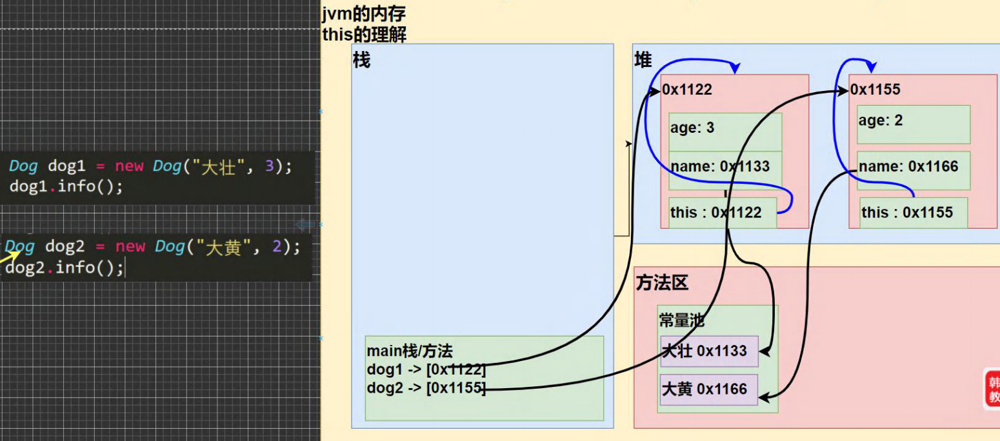

# this关键字

*   基本介绍

    [goto：This01.java](https://gitee.com/jia-yan\_dong/code/blob/master/Java/javacode/chapter07/This01.java)

    > 1. java虚拟机会给每个对象分配this,代表当前对象。坦白的讲，要明白this不是件容易的事

*   深入理解 this

    <figure><figcaption></figcaption></figure>

*   注意事项和使用细节

    [goto：ThisDetail.java](https://gitee.com/jia-yan\_dong/code/blob/master/Java/javacode/chapter07/ThisDetail.java)

    > 1. this 关键字可以用来访问本类的属性、方法、构造器&#x20;
    > 2. this 用于区分当前类的属性和局部变量
    > 3. 访问成员方法的语法：this.方法名(参数列表)
    > 4. 访问构造器语法：this(参数列表); 注意只能在构造器中使用(即只能在构造器中访问另外一个构造器, 必须放在第一 条语句)
    > 5. this 不能在类定义的外部使用，只能在类定义的方法中使用。
